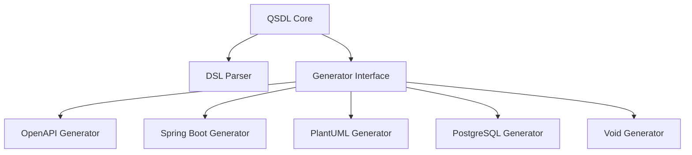

# QSDL - Schema Definition Language Generator

## Project Overview

**QSDL** (Query Schema Definition Language) is a domain-driven code generation framework inspired by GraphQL. It provides a minimalistic approach to API definition for generating CRUD operations, boilerplate code, and specifications from a schema definition.

### Key Characteristics

- **Domain-Driven Design**: Focuses on domain models with parent-child relationships
- **GraphQL-inspired**: Uses a GraphQL-like syntax with extensions for OpenAPI and QoL features
- **Multi-Generator**: Supports multiple output formats (OpenAPI, Spring Boot, PlantUML, etc.)
- **Extensible Architecture**: Modular design with pluggable generators and directives

## Core Architecture

### Language Components

QSDL defines a meta-language with these main constructs:

1. **Schema**: Root definition with title, version, description, and servers
2. **Types**: Scalar, Enum, Base, Object, and Api types
3. **Directives**: Special annotations that modify generation behavior
4. **Operations**: API endpoints with methods, paths, and parameters

### Built-in Types

- **Scalar**: Primitive types (Int, Long, Float, Double, String, Boolean, Date, Object, Void)
- **Enum**: Fixed set of string values
- **Base**: Abstract types with fields (similar to interfaces)
- **Object**: Concrete domain entities that generate CRUD operations
- **Api**: Custom API endpoints and operations

### Directives System

QSDL uses directives to control code generation behavior:

- **Field Directives**: `@query`, `@unique`, `@hidden`, `@readOnly`, `@writeOnly`, `@composition`, `@aggregation`
- **Operation Directives**: `@path`, `@method`, `@namespace`, `@pagination`, `@produce`, `@consumes`, `@generate`
- **Validation Directives**: `@minSize`, `@maxSize`, `@default`
- **Generation Control**: `@ignore`, `@transient`, `@override`, `@force-generate`

## Generator Architecture

### Core Components



### Key Modules

1. **DSL Module** (`src/qsdl/dsl/`)
   - TextX-based parser for QSDL language
   - Model definitions and validation
   - Directive processing

2. **Generators Module** (`src/qsdl/generators/`)
   - Base configuration system
   - Pluggable generator architecture
   - Jinja2 template rendering

3. **Core Module** (`src/qsdl/core.py`)
   - Main generation workflow
   - Configuration management
   - Interactive CLI prompts

### Spring Boot Generator

The Spring Boot generator is the most comprehensive implementation:

- **Configuration Options**: Database (Hibernate/No), ID types, package structure, auditing, builders
- **Custom Directives**: `@spring`, `@spring-package`, `@spring-controller`, `@spring-void-input`
- **Package Customization**: Flexible package layout with placeholders
- **Domain Patterns**: Support for DTOs, entities, mappers, repositories, services

## Technical Stack

- **Language**: Python 3.13+
- **Parser**: TextX (meta-language definition)
- **Templates**: Jinja2 (code generation)
- **Configuration**: Dataclasses with Dacite for JSON parsing
- **CLI**: Interactive prompts with Inquirer
- **Build**: UV for dependency management

## Testing

The project uses UV for dependency management and test execution:

```bash
# Run all tests
uv run pytest

# Run specific test file
uv run pytest tests/functional/test_specifics_spring.py

# Run specific test
uv run pytest tests/functional/test_specifics_spring.py::TestSpecificsSpring::test_specifics_14 -v
```

## Testing Code Generation

To test code generation with the Spring Boot generator:

```bash
# Generate with basic layout (no config)
qsdl examples/spring/relation.qsdl -g spring -o examples/spring/basic_layout

# Generate with domain layout (with custom config)
qsdl examples/spring/relation.qsdl -g spring -c util/domain_config.json -o examples/spring/domain_layout

# VSCode tasks are available - see .vscode/tasks.json
# Run "generate spring" task to generate both layouts
```

## Project Structure

```
qsdl/
├── src/
│   ├── qsdl/
│   │   ├── core.py              # Main generation logic
│   │   ├── generators/          # Generator implementations
│   │   │   ├── spring/          # Spring Boot generator
│   │   │   ├── openapi/         # OpenAPI generator
│   │   │   ├── plantuml/        # PlantUML generator
│   │   │   └── ...
│   │   ├── dsl/                 # Domain Specific Language
│   │   │   ├── definition/      # Language grammar
│   │   │   ├── models/          # AST models
│   │   │   └── processors/      # Model processing
│   │   └── ...
├── examples/                   # Example schemas
├── tests/                      # Test suite
└── docs/                       # Documentation
```

## Key Features

### Automatic CRUD Generation

A simple Object definition generates:
- GET ALL (collection endpoint)
- POST (create endpoint)
- GET (single item endpoint)
- PATCH (update endpoint)
- DELETE (delete endpoint)

### Domain Relationships

- **Composition**: Parent-child relationships with cascade operations
- **Aggregation**: Independent relationships between entities
- **Inheritance**: Base types for common field definitions

### Customization Points

1. **Directives**: Fine-grained control over generation
2. **Configuration**: Generator-specific options via JSON
3. **Templates**: Jinja2 templates for code structure
4. **Package Layout**: Customizable package organization

## Example Use Cases

### Basic Domain Object

```qsdl
base BaseType {
    name: String! @query
    description: String
    creation_date: Date @readOnly
}

type Project extends BaseType {
    archive: Boolean @writeOnly
    archived: Boolean @readOnly
}
```

### Custom API Endpoint

```qsdl
extend api {
    uploadFile(file: MultipartFile!, docType: String, entityId: UUID!): Void 
        @path("upload") 
        @method(POST) 
        @consumes("multipart/form-data") 
        @spring-void-input
}
```

### Complex Relationships

```qsdl
type Foo {
    bar_id: Int @writeOnly
    bar: Bar @readOnly
}

type Bar {
    field: String
}
```

## Development Workflow

1. **Schema Definition**: Create `.qsdl` files with domain models
2. **Configuration**: Set generator options via JSON or CLI
3. **Generation**: Run `qsdl` command to generate code
4. **Customization**: Modify templates or add directives as needed

## Integration Points

- **CLI**: `qsdl input.qsdl -g spring -c config.json -o output/`
- **Python API**: Import and use `qsdl.core.generate()` directly
- **Configuration**: JSON files or Python dataclasses
- **Extensions**: Add new generators by implementing the generator interface

## Best Practices

1. **Domain-First**: Design domain models before API endpoints
2. **Directive Usage**: Use directives for fine-grained control
3. **Base Types**: Create common base types for shared fields
4. **Package Organization**: Use `@namespace` for logical grouping
5. **Validation**: Leverage `@minSize`, `@maxSize` for input validation

## Future Directions

- Additional generators (GraphQL, TypeScript, etc.)
- Enhanced relationship handling
- Performance optimizations
- Improved error reporting
- Extended directive system

## Getting Started

```bash
# Install
echo "type Project { name: String }" > project.qsdl
qsdl project.qsdl -g openapi

# Explore examples
cd examples/openapi
qsdl input.qsdl -g openapi
```

## Resources

- **Documentation**: `docs/` directory
- **Examples**: `examples/` directory
- **Language Spec**: `qsdl/dsl/definition/entity.qsdl`
- **Tests**: `tests/` directory

This project provides a powerful foundation for domain-driven API development with flexible code generation capabilities.