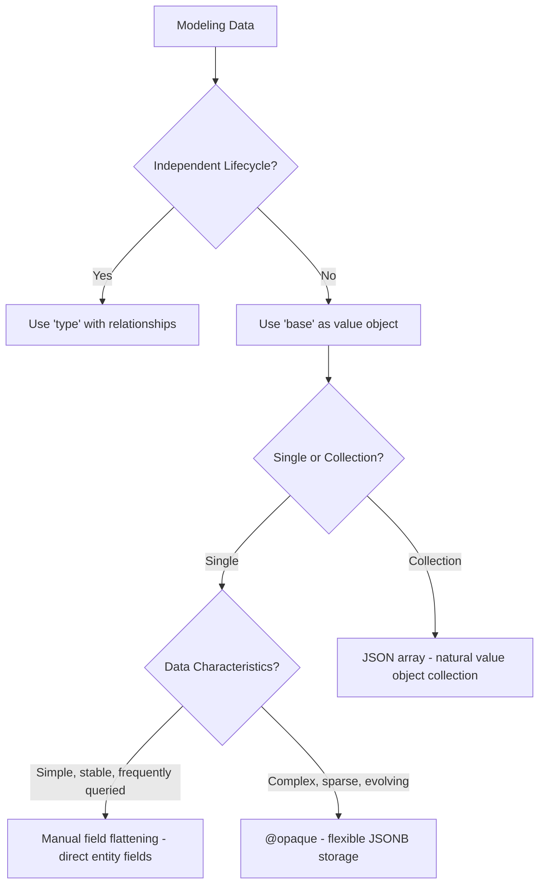

# Basic Data Modeling with QSDL

## Overview

QSDL provides a sophisticated yet intuitive approach to data modeling through two fundamental constructs: `base` types and `type` declarations. This guide explains how to effectively use these building blocks to create clean, efficient data models that work seamlessly across API and database layers.

## Base Types vs Types

### Base Types: Value Objects

**Base types** represent value objects - simple data structures that group related fields together. They are ideal for representing concepts like addresses, coordinates, or metadata that don't have independent lifecycles.

```qsdl
base Address {
  street: String
  city: String
  postalCode: String
  country: String
}

base AuditInfo {
  createdAt: Datetime
  createdBy: String
  updatedAt: Datetime
  updatedBy: String
}
```

**Key Characteristics:**

- No independent identity (no `id` field)
- Used for composition and grouping
- Default behavior: **flattened into parent tables**
- Can be extended by other base types or types

### Types: Domain Entities

**Types** represent domain entities with independent lifecycles. They form the core of your domain model and can participate in relationships.

```qsdl
type User {
  username: String!
  email: String!
  address: Address  # Base type used as field
  auditInfo: AuditInfo
}

type Product {
  name: String!
  price: Float
  description: String
}
```

**Key Characteristics:**

- Have independent identity (automatically get `id`, `uid`, `iv` fields)
- Can participate in relationships (`@composition`, `@aggregation`)
- Represent real domain concepts
- Can use base types as fields

## Database Layer Behavior

QSDL implements intelligent database storage strategies that automatically adapt to your data modeling needs. The database layer behavior is optimized for each use case while maintaining a consistent API layer (OpenAPI) representation.

### Default Behavior: Manual Field Flattening

**When:** `field: Base` (no directive)

By default, base type fields are **manually flattened** into the parent entity class. Each field from the base type becomes a direct field in the entity with appropriate column naming:

```qsdl
base ContactInfo {
  email: String
  phone: String
}

type Customer {
  name: String!
  contact: ContactInfo  # No directive = flatten
}
```

**Generated PostgreSQL Schema:**

```sql
CREATE TABLE t_customer (
  id BIGINT generated by default as identity primary key,
  uid VARCHAR unique,
  iv INTEGER,
  name TEXT NOT NULL,
  contact_email TEXT,      -- Flattened with prefix
  contact_phone TEXT       -- Flattened with prefix
);
```

**Generated Spring Boot Entity:**

```java
@Getter
@Setter
@Entity
@Table(name = "t_customer")
public class CustomerEntity extends AbstractPersistentObject {
  private String name;

  // Manually flattened base type fields
  private String contactEmail;

  private String contactPhone;

}
```

### Opaque Storage with @opaque

**When:** `field: Base @opaque`

The `@opaque` directive indicates that the base type should be stored as a single JSONB column, making it opaque to the database layer.

```qsdl
base PerformanceMetrics {
  responseTime: Float
  errorRate: Float
  throughput: Int
  memoryUsage: Float
}

type Service {
  name: String!
  metrics: PerformanceMetrics @opaque  # Store as JSONB
}
```

**Generated PostgreSQL Schema:**

```sql
CREATE TABLE t_service (
  id BIGINT generated by default as identity primary key,
  uid VARCHAR unique,
  iv INTEGER,
  name TEXT NOT NULL,
  metrics JSONB  -- Single JSONB column containing all metrics
);
```

**Generated Spring Boot Entity:**

```java
@Entity
@Table(name = "t_service")
public class ServiceEntity extends AbstractPersistentObject {
  private String name;

  @JdbcTypeCode(SqlTypes.JSON)
  @Column(columnDefinition = "jsonb")
  private PerformanceMetrics metrics;  // Regular POJO for JSONB storage
}
```

## API Layer Behavior (OpenAPI)

Importantly, the API layer behavior remains **unchanged** regardless of the database storage strategy. The OpenAPI specification will always show nested objects:

```yaml
# Both examples generate the same OpenAPI schema
components:
  schemas:
    Customer:
      type: object
      properties:
        name:
          type: string
        contact:
          $ref: "#/components/schemas/ContactInfo"

    ContactInfo:
      type: object
      properties:
        email:
          type: string
        phone:
          type: string
```

The `@opaque` directive is a **database-level optimization hint** that doesn't affect the API contract.

## Base Type Inheritance

Base types can extend other base types, and the fields are automatically flattened at the DSL parsing stage:

```qsdl
base BaseEntity {
  createdAt: Datetime
  createdBy: String
}

base AuditableEntity extends BaseEntity {
  updatedAt: Datetime
  updatedBy: String
}

type Document extends AuditableEntity {
  title: String!
  content: String
}
```

**Result:** The `Document` type will have all four fields (`createdAt`, `createdBy`, `updatedAt`, `updatedBy`) directly available, as if they were defined inline.

## When to Use Each Approach

### Use Default Flattening When:

✅ **Simple value objects** (2-8 fields)
✅ **Fields are frequently populated**  
✅ **Need database-level validation and constraints**
✅ **Want standard SQL indexing**
✅ **Examples:** Address, ContactInfo, Coordinates, MoneyAmount

```qsdl
base Address {
  street: String
  city: String
  postalCode: String
  country: String
}

type User {
  name: String!
  address: Address  # Default flattening is perfect here
}
```

### Use @opaque When:

✅ **Complex nested structures** (8+ fields)
✅ **Sparse/optional data** (many fields often NULL)
✅ **Document-like or semi-structured data**
✅ **Frequently evolving structure** (avoid migrations)
✅ **No need for SQL querying of nested fields**
✅ **Examples:** Configuration, AnalyticsData, RawAPIResponses

```qsdl
base AnalyticsData {
  pageViews: Int
  uniqueVisitors: Int
  bounceRate: Float
  averageSessionDuration: Float
  conversionRate: Float
  # ... 15+ more metrics
}

type Website {
  url: String!
  analytics: AnalyticsData @opaque  # Better as JSONB
}
```

## Arrays of Base Types

### Always JSONB Storage

**Important:** Arrays of base types **always** generate JSONB columns in the current implementation, regardless of the `@opaque` directive. This is because base types represent value objects, and arrays of value objects are naturally stored as JSON arrays.

```qsdl
base Tag {
  name: String
  category: String
}

base Variant {
  size: String
  color: String
  priceAdjustment: Float
}

type Article {
  title: String!
  tags: [Tag]          # Always JSONB
  variants: [Variant]  # Always JSONB
  specialTags: [Tag] @opaque  # Also JSONB (directive has no effect on arrays)
}
```

**Generated PostgreSQL Schema:**

```sql
CREATE TABLE t_article (
  id BIGINT generated by default as identity primary key,
  uid VARCHAR unique,
  iv INTEGER,
  title TEXT NOT NULL,
  tags JSONB,                    -- [{"name": "tech", "category": "topic"}, ...]
  variants JSONB,                -- [{"size": "M", "color": "red"}, ...]
  special_tags JSONB             -- Same as tags (directive ignored for arrays)
);
```

**Rationale:** Since base types are value objects without independent identity, storing them in join tables would be overly complex. JSONB arrays provide a natural, efficient storage mechanism for collections of value objects.

### For Entity Relationships: Use Types

If you need proper entity relationships with join tables (for referential integrity, independent lifecycles, or complex querying), use `type` instead of `base`:

```qsdl
type Category {
  name: String!
  description: String
}

type Article {
  title: String!
  categories: [Category] @aggregation  # Creates join table
}
```

**Generated PostgreSQL Schema:**

```sql
CREATE TABLE t_article (
  id BIGINT generated by default as identity primary key,
  uid VARCHAR unique,
  iv INTEGER,
  title TEXT NOT NULL
);

CREATE TABLE t_category (
  id BIGINT generated by default as identity primary key,
  uid VARCHAR unique,
  iv INTEGER,
  name TEXT NOT NULL,
  description TEXT
);

CREATE TABLE t_article_categories_to_t_category (
  source_id BIGINT REFERENCES t_article(id),
  target_id BIGINT REFERENCES t_category(id)
);
```

## Real Relationships: Use Types with Directives

For actual entity relationships (not value objects), use `type` with relationship directives:

```qsdl
type Address {
  street: String
  city: String
  postalCode: String
}

type User {
  username: String!
  homeAddress: Address @composition  # Real entity relationship
  workAddress: Address @aggregation  # Shared reference
}
```

**Key Differences:**

- `Address` is a `type`, not a `base`
- Has its own lifecycle and identity
- Can be shared across multiple users
- Creates proper foreign key relationships

## Comparison: Storage Approaches

### Single Base Types

| Aspect                     | Manual Flattening (Default)       | JSONB with @opaque              |
| -------------------------- | --------------------------------- | ------------------------------- |
| **Database Validation**    | ✅ Full constraints               | ❌ None                         |
| **Indexing**               | ✅ Standard B-tree indexes        | ⚠️ GIN indexes only             |
| **Query Performance**      | ✅ Fast                           | ⚠️ Slower for deep paths        |
| **Schema Flexibility**     | ❌ DDL changes needed             | ✅ No schema changes            |
| **Application Validation** | ✅ Jackson/Bean Validation        | ✅ Jackson/Bean Validation      |
| **Column Count**           | ⚠️ Increases with fields          | ✅ Fixed (1 column)             |
| **Implementation**         | Direct entity fields              | Hibernate JSON mapping          |
| **Use Case**               | Simple value objects (2-8 fields) | Complex/sparse data (8+ fields) |

### Arrays of Base Types

**Note:** Arrays of base types **always** use JSONB storage, regardless of the `@opaque` directive.

| Aspect                     | JSONB Storage                       |
| -------------------------- | ----------------------------------- |
| **Database Validation**    | ❌ None                             |
| **Indexing**               | ⚠️ GIN indexes only                 |
| **Query Performance**      | ⚠️ Slower for deep paths            |
| **Schema Flexibility**     | ✅ No schema changes                |
| **Application Validation** | ✅ Jackson/Bean Validation          |
| **Use Case**               | Collections of value objects        |
| **Alternative**            | Use `type` for entity relationships |

## Implementation Details

### Manual Flattening Strategy

QSDL implements base type flattening by directly incorporating the base type fields into the entity class rather than using JPA's `@Embedded` mechanism. This approach provides several benefits:

**Naming Convention:**

```
entityFieldName + BaseFieldName (camelCase) → entityFieldNameBaseFieldName
```

### Real-World Example

Here's a comprehensive example showing how complex base type inheritance and composition are handled:

**QSDL Schema:**

```qsdl
base Bar {
  string_field: String
}

base A {
  int_field: Int
  long_field: Long
}

base B extends A {
  float_field: Float
  double_field: Double
  string_field: String
  fruit: Bar
}

type Foo {
  a_field: B
  b_field: B
  boolean_field: Boolean
  date_field: Date
  datetime_field: Datetime
  object_field: Object
}
```

**Generated Spring Boot Entity:**

```java
@Getter
@Setter
@Entity
@Table(name = "t_foo")
public class FooEntity extends AbstractPersistentObject {

    // Fields from a_field: B (which extends A)
    private Integer aFieldIntField;
    private Long aFieldLongField;
    private Float aFieldFloatField;
    private Double aFieldDoubleField;
    private String aFieldStringField;
    private String aFieldFruitStringField;

    // Fields from b_field: B (which extends A)
    private Integer bFieldIntField;
    private Long bFieldLongField;
    private Float bFieldFloatField;
    private Double bFieldDoubleField;
    private String bFieldStringField;
    private String bFieldFruitStringField;

    // Direct fields from Foo
    private Boolean booleanField;
    private LocalDate dateField;
    private OffsetDateTime datetimeField;

    @JdbcTypeCode(SqlTypes.JSON)
    private ObjectNode objectField;
}
```

**Key Observations:**

1. **Base type inheritance**: Fields from `A` are included in `B` and then flattened
2. **Multiple instances**: Both `a_field` and `b_field` of type `B` get their own flattened fields
3. **Nested base types**: The `fruit: Bar` field within `B` is also flattened
4. **Field naming**: Follows `entityFieldNameBaseFieldName` pattern (e.g., `aFieldIntField`)
5. **Direct types**: Non-base type fields like `object_field` use appropriate mappings

**Generated PostgreSQL Schema:**

```sql
CREATE TABLE t_foo (
  id BIGINT generated by default as identity primary key,
  uid VARCHAR unique,
  iv INTEGER,
  a_field_int_field INTEGER,
  a_field_long_field BIGINT,
  a_field_float_field REAL,
  a_field_double_field DOUBLE PRECISION,
  a_field_string_field TEXT,
  a_field_fruit_string_field TEXT,
  b_field_int_field INTEGER,
  b_field_long_field BIGINT,
  b_field_float_field REAL,
  b_field_double_field DOUBLE PRECISION,
  b_field_string_field TEXT,
  b_field_fruit_string_field TEXT,
  boolean_field BOOLEAN,
  date_field DATE,
  datetime_field TIMESTAMP,
  object_field JSONB
);
```

**Advantages of Manual Flattening:**

- ✅ **Simpler entity structure** - No nested embeddable classes
- ✅ **Direct field access** - No wrapper object needed
- ✅ **Better query performance** - Direct column mapping
- ✅ **Easier to extend** - Can add custom logic to individual fields
- ✅ **Consistent with JPA best practices** - Follows same patterns as manual mapping
- ✅ **Handles complex inheritance** - Properly flattens extended base types
- ✅ **Supports multiple instances** - Each field gets its own flattened representation

## Best Practices

### 1. Start with Default Manual Flattening

Begin with the default manual flattening approach and only use `@opaque` when you encounter specific needs:

- Performance issues with many columns
- Schema migration challenges
- Sparse data patterns

### 2. Use @opaque for Configuration and Metadata

```qsdl
base AppConfig {
  theme: String
  language: String
  notificationsEnabled: Boolean
  darkMode: Boolean
  # ... many more settings
}

type UserPreferences {
  userId: String!
  config: AppConfig @opaque  # Perfect for user settings
}
```

### 3. Consider @opaque for Deep Nesting

Deeply nested base types can lead to very long column names when flattened:

```qsdl
base ContactInfo {
  email: String
  phone: String
}

base Address {
  street: String
  contact: ContactInfo  # Nested base type
}

type Company {
  headquarters: Address          # Flattened: headquarters_street, headquarters_contact_email, etc.
  branches: [Address]            # Always JSONB for arrays
  remoteOffices: Address @opaque # JSONB for complex nested structures
}
```

**Guideline:** For deeply nested single base types, consider `@opaque` to avoid excessively long column names and complex schemas.

### 4. Document Your Storage Strategy

Add comments to explain why you chose a particular approach:

```qsdl
base SimpleMetrics {
  # Using default flattening for performance
  # These fields are always populated and frequently queried
  responseTime: Float
  successRate: Float
}

base ComplexAnalytics {
  # Using @opaque due to 20+ sparse fields
  # Structure evolves frequently
  pageViews: Int
  uniqueVisitors: Int
  # ... 18 more fields
  @opaque
}
```

## Schema Evolution

### With Flattened Storage

When using the default flattened approach:

- **Adding fields:** Requires `ALTER TABLE ADD COLUMN`
- **Removing fields:** Requires `ALTER TABLE DROP COLUMN`
- **Changing field types:** Requires column type changes
- **Best for:** Stable schemas with simple value objects

### With @opaque Storage

When using JSONB storage with `@opaque`:

- **Adding fields:** No migration needed (JSONB is schema-flexible)
- **Removing fields:** No migration needed
- **Changing field types:** May require data transformation
- **Best for:** Evolving schemas with complex or sparse data

## Summary

QSDL provides a powerful and flexible approach to data modeling that combines the best aspects of relational and document databases.

### Core Principles

1. **Base types as value objects** - Simple data structures without independent identity
2. **Manual field flattening** - Single base type fields become direct entity fields with proper naming
3. **Document-style optimization** - `@opaque` directive for complex or sparse data
4. **Natural array handling** - Collections of value objects stored efficiently as JSON
5. **Consistent API layer** - OpenAPI specification remains unchanged regardless of storage strategy
6. **Clear domain modeling** - Distinction between value objects (`base`) and entities (`type`)

### Storage Strategy Decision Guide



### Best Practices

- ✅ **Start simple**: Use manual field flattening for most value objects
- ✅ **Optimize selectively**: Apply `@opaque` only when you hit specific needs
- ✅ **Leverage JSON for collections**: Arrays of base types provide efficient storage
- ✅ **Use types for relationships**: Reserve `type` for entities with independent lifecycles
- ✅ **Document your choices**: Add comments explaining your storage strategy
- ✅ **Consider query patterns**: Choose storage based on how data will be accessed
- ✅ **Direct field access**: Take advantage of direct entity field access for better performance

QSDL's approach provides a robust, flexible foundation for data modeling that handles everything from simple value objects to complex inheritance hierarchies, all while maintaining a clean, consistent API contract across all generated outputs.
