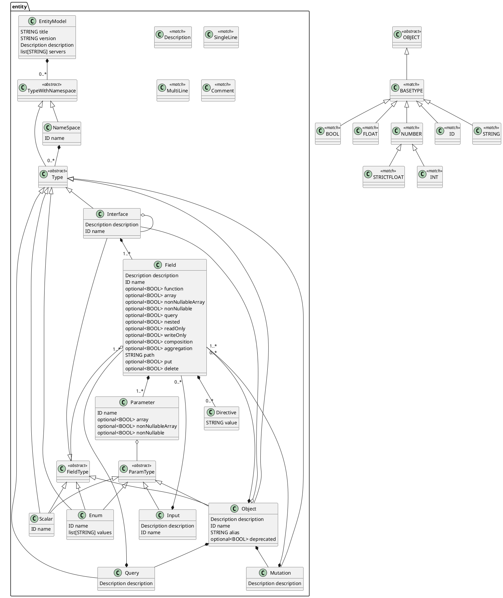

```plantuml
@startuml
set namespaceSeparator .


class entity.EntityModel  {
  STRING title
  STRING version
  Description description
  list[STRING] servers
}


class entity.Type <<abstract>> {
}


class entity.TypeWithNamespace <<abstract>> {
}


class entity.FieldType <<abstract>> {
}


class entity.ParamType <<abstract>> {
}


class entity.NameSpace  {
  ID name
}


class entity.Scalar  {
  ID name
}


class entity.Enum  {
  ID name
  list[STRING] values
}


class entity.Interface  {
  Description description
  ID name
}


class entity.Input  {
  Description description
  ID name
}


class entity.Query  {
  Description description
}


class entity.Mutation  {
  Description description
}


class entity.Object  {
  Description description
  ID name
  STRING alias
  optional<BOOL> deprecated
}


class entity.Field  {
  Description description
  ID name
  optional<BOOL> function
  optional<BOOL> array
  optional<BOOL> nonNullableArray
  optional<BOOL> nonNullable
  optional<BOOL> query
  optional<BOOL> nested
  optional<BOOL> readOnly
  optional<BOOL> writeOnly
  optional<BOOL> composition
  optional<BOOL> aggregation
  STRING path
  optional<BOOL> put
  optional<BOOL> delete
}


class entity.Parameter  {
  ID name
  optional<BOOL> array
  optional<BOOL> nonNullableArray
  optional<BOOL> nonNullable
}


class entity.Directive  {
  STRING value
}


class entity.Description <<match>> {
}


class entity.SingleLine <<match>> {
}


class entity.MultiLine <<match>> {
}


class entity.Comment <<match>> {
}


class ID <<match>> {
}


class STRING <<match>> {
}


class BOOL <<match>> {
}


class INT <<match>> {
}


class FLOAT <<match>> {
}


class STRICTFLOAT <<match>> {
}


class NUMBER <<match>> {
}


class BASETYPE <<match>> {
}


class OBJECT <<abstract>> {
}


entity.EntityModel *-- "0..*" entity.TypeWithNamespace
entity.Type <|-- entity.Scalar
entity.Type <|-- entity.Enum
entity.Type <|-- entity.Interface
entity.Type <|-- entity.Query
entity.Type <|-- entity.Mutation
entity.Type <|-- entity.Object
entity.TypeWithNamespace <|-- entity.NameSpace
entity.TypeWithNamespace <|-- entity.Type
entity.FieldType <|-- entity.Scalar
entity.FieldType <|-- entity.Enum
entity.FieldType <|-- entity.Interface
entity.FieldType <|-- entity.Object
entity.ParamType <|-- entity.Scalar
entity.ParamType <|-- entity.Enum
entity.ParamType <|-- entity.Input
entity.ParamType <|-- entity.Object
entity.NameSpace *-- "0..*" entity.Type
entity.Interface o-- entity.Interface
entity.Interface *-- "1..*" entity.Field
entity.Input *-- "0..*" entity.Field
entity.Query *-- "1..*" entity.Field
entity.Mutation *-- "1..*" entity.Field
entity.Object o-- entity.Interface
entity.Object *-- "0..*" entity.Field
entity.Object *-- entity.Query
entity.Object *-- entity.Mutation
entity.Field *-- "1..*" entity.Parameter
entity.Field o-- entity.FieldType
entity.Field *-- "0..*" entity.Directive
entity.Parameter o-- entity.ParamType
NUMBER <|-- STRICTFLOAT
NUMBER <|-- INT
BASETYPE <|-- NUMBER
BASETYPE <|-- FLOAT
BASETYPE <|-- BOOL
BASETYPE <|-- ID
BASETYPE <|-- STRING
OBJECT <|-- BASETYPE
@enduml
```