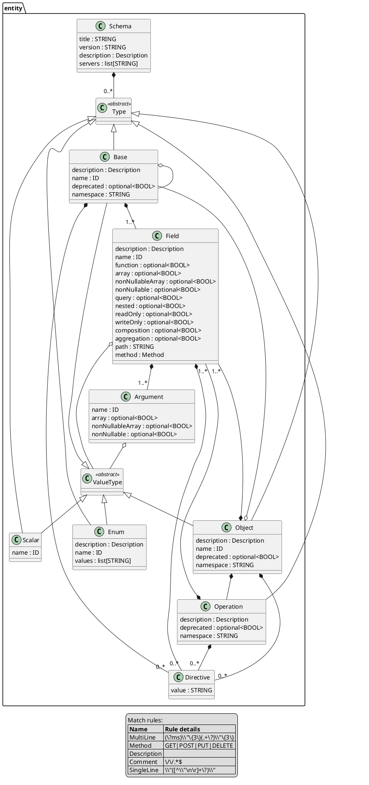

```plantuml
@startuml
set namespaceSeparator .


class entity.Schema  {
  title : STRING
  version : STRING
  description : Description
  servers : list[STRING]
}


class entity.Type <<abstract>> {
}


class entity.ValueType <<abstract>> {
}


class entity.Scalar  {
  name : ID
}


class entity.Enum  {
  description : Description
  name : ID
  values : list[STRING]
}


class entity.Base  {
  description : Description
  name : ID
  deprecated : optional<BOOL>
  namespace : STRING
}


class entity.Operation  {
  description : Description
  deprecated : optional<BOOL>
  namespace : STRING
}


class entity.Object  {
  description : Description
  name : ID
  deprecated : optional<BOOL>
  namespace : STRING
}


class entity.Field  {
  description : Description
  name : ID
  function : optional<BOOL>
  array : optional<BOOL>
  nonNullableArray : optional<BOOL>
  nonNullable : optional<BOOL>
  query : optional<BOOL>
  nested : optional<BOOL>
  readOnly : optional<BOOL>
  writeOnly : optional<BOOL>
  composition : optional<BOOL>
  aggregation : optional<BOOL>
  path : STRING
  method : Method
}


class entity.Argument  {
  name : ID
  array : optional<BOOL>
  nonNullableArray : optional<BOOL>
  nonNullable : optional<BOOL>
}


class entity.Directive  {
  value : STRING
}


entity.Schema *-- "0..*" entity.Type
entity.Type <|-- entity.Scalar
entity.Type <|-- entity.Enum
entity.Type <|-- entity.Base
entity.Type <|-- entity.Operation
entity.Type <|-- entity.Object
entity.ValueType <|-- entity.Scalar
entity.ValueType <|-- entity.Enum
entity.ValueType <|-- entity.Base
entity.ValueType <|-- entity.Object
entity.Base o-- entity.Base
entity.Base *-- "0..*" entity.Directive
entity.Base *-- "1..*" entity.Field
entity.Operation *-- "0..*" entity.Directive
entity.Operation *-- "1..*" entity.Field
entity.Object o-- entity.Base
entity.Object *-- "0..*" entity.Directive
entity.Object *-- "1..*" entity.Field
entity.Object *-- entity.Operation
entity.Field *-- "1..*" entity.Argument
entity.Field o-- entity.ValueType
entity.Field *-- "0..*" entity.Directive
entity.Argument o-- entity.ValueType

legend
  Match rules:
  |= Name  |= Rule details |
  | MultiLine | (\?ms)\\\"\{3\}(.+\?)\\\"\{3\} |
  | Method | GET\|POST\|PUT\|DELETE |
  | Description |  |
  | Comment | \\/\\/.*$ |
  | SingleLine | \\\"([^\\\"\\n\\r]+\?)\\\" |
end legend

@enduml
```