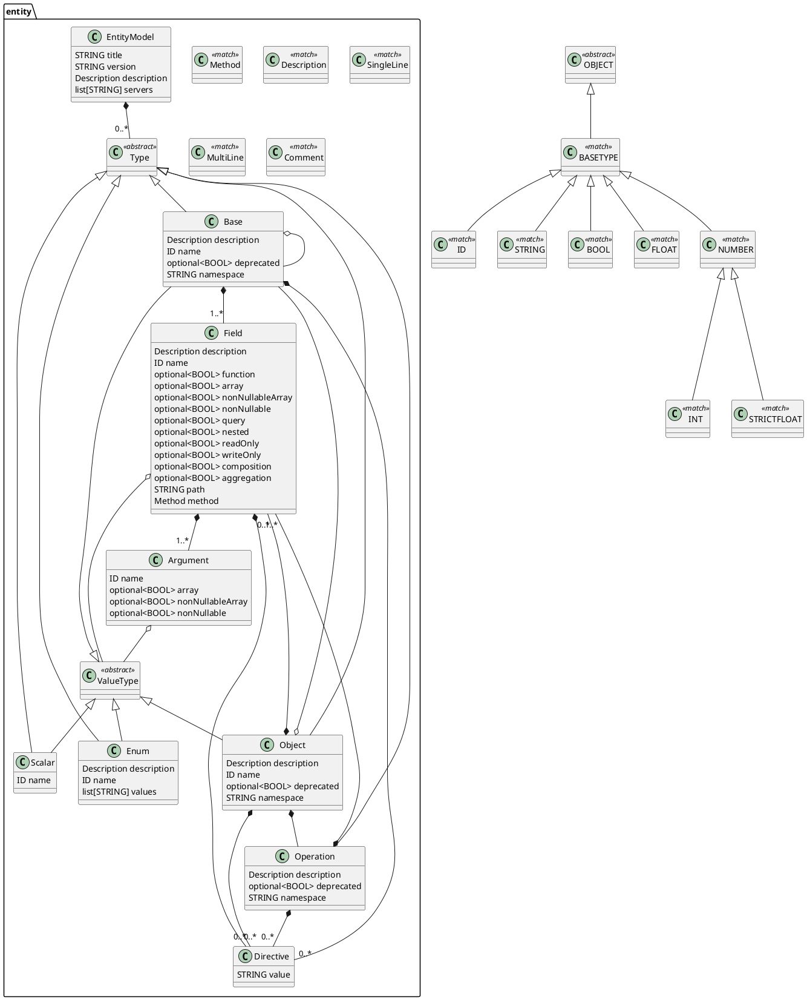

```plantuml
@startuml
set namespaceSeparator .


class entity.EntityModel  {
  STRING title
  STRING version
  Description description
  list[STRING] servers
}


class entity.Type <<abstract>> {
}


class entity.ValueType <<abstract>> {
}


class entity.Scalar  {
  ID name
}


class entity.Enum  {
  Description description
  ID name
  list[STRING] values
}


class entity.Base  {
  Description description
  ID name
  optional<BOOL> deprecated
  STRING namespace
}


class entity.Operation  {
  Description description
  optional<BOOL> deprecated
  STRING namespace
}


class entity.Object  {
  Description description
  ID name
  optional<BOOL> deprecated
  STRING namespace
}


class entity.Field  {
  Description description
  ID name
  optional<BOOL> function
  optional<BOOL> array
  optional<BOOL> nonNullableArray
  optional<BOOL> nonNullable
  optional<BOOL> query
  optional<BOOL> nested
  optional<BOOL> readOnly
  optional<BOOL> writeOnly
  optional<BOOL> composition
  optional<BOOL> aggregation
  STRING path
  Method method
}


class entity.Argument  {
  ID name
  optional<BOOL> array
  optional<BOOL> nonNullableArray
  optional<BOOL> nonNullable
}


class entity.Method <<match>> {
}


class entity.Directive  {
  STRING value
}


class entity.Description <<match>> {
}


class entity.SingleLine <<match>> {
}


class entity.MultiLine <<match>> {
}


class entity.Comment <<match>> {
}


class ID <<match>> {
}


class STRING <<match>> {
}


class BOOL <<match>> {
}


class INT <<match>> {
}


class FLOAT <<match>> {
}


class STRICTFLOAT <<match>> {
}


class NUMBER <<match>> {
}


class BASETYPE <<match>> {
}


class OBJECT <<abstract>> {
}


entity.EntityModel *-- "0..*" entity.Type
entity.Type <|-- entity.Scalar
entity.Type <|-- entity.Enum
entity.Type <|-- entity.Base
entity.Type <|-- entity.Operation
entity.Type <|-- entity.Object
entity.ValueType <|-- entity.Scalar
entity.ValueType <|-- entity.Enum
entity.ValueType <|-- entity.Base
entity.ValueType <|-- entity.Object
entity.Base o-- entity.Base
entity.Base *-- "0..*" entity.Directive
entity.Base *-- "1..*" entity.Field
entity.Operation *-- "0..*" entity.Directive
entity.Operation *-- "1..*" entity.Field
entity.Object o-- entity.Base
entity.Object *-- "0..*" entity.Directive
entity.Object *-- "0..*" entity.Field
entity.Object *-- entity.Operation
entity.Field *-- "1..*" entity.Argument
entity.Field o-- entity.ValueType
entity.Field *-- "0..*" entity.Directive
entity.Argument o-- entity.ValueType
NUMBER <|-- STRICTFLOAT
NUMBER <|-- INT
BASETYPE <|-- NUMBER
BASETYPE <|-- FLOAT
BASETYPE <|-- BOOL
BASETYPE <|-- ID
BASETYPE <|-- STRING
OBJECT <|-- BASETYPE
@enduml
```