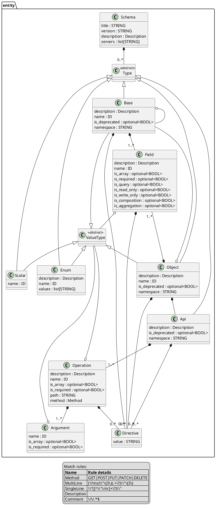

```plantuml
@startuml
set namespaceSeparator .


class entity.Schema  {
  title : STRING
  version : STRING
  description : Description
  servers : list[STRING]
}


class entity.Type <<abstract>> {
}


class entity.ValueType <<abstract>> {
}


class entity.Scalar  {
  name : ID
}


class entity.Enum  {
  description : Description
  name : ID
  values : list[STRING]
}


class entity.Base  {
  description : Description
  name : ID
  is_deprecated : optional<BOOL>
  namespace : STRING
}


class entity.Object  {
  description : Description
  name : ID
  is_deprecated : optional<BOOL>
  namespace : STRING
}


class entity.Field  {
  description : Description
  name : ID
  is_array : optional<BOOL>
  is_required : optional<BOOL>
  is_query : optional<BOOL>
  is_read_only : optional<BOOL>
  is_write_only : optional<BOOL>
  is_composition : optional<BOOL>
  is_aggregation : optional<BOOL>
}


class entity.Api  {
  description : Description
  is_deprecated : optional<BOOL>
  namespace : STRING
}


class entity.Operation  {
  description : Description
  name : ID
  is_array : optional<BOOL>
  is_required : optional<BOOL>
  path : STRING
  method : Method
}


class entity.Argument  {
  name : ID
  is_array : optional<BOOL>
  is_required : optional<BOOL>
}


class entity.Directive  {
  value : STRING
}


entity.Schema *-- "0..*" entity.Type
entity.Type <|-- entity.Scalar
entity.Type <|-- entity.Enum
entity.Type <|-- entity.Base
entity.Type <|-- entity.Api
entity.Type <|-- entity.Object
entity.ValueType <|-- entity.Scalar
entity.ValueType <|-- entity.Enum
entity.ValueType <|-- entity.Base
entity.ValueType <|-- entity.Object
entity.Base o-- entity.Base
entity.Base *-- "0..*" entity.Directive
entity.Base *-- "1..*" entity.Field
entity.Object o-- entity.Base
entity.Object *-- "0..*" entity.Directive
entity.Object *-- "1..*" entity.Field
entity.Object *-- entity.Api
entity.Field o-- entity.ValueType
entity.Field *-- "0..*" entity.Directive
entity.Api *-- "0..*" entity.Directive
entity.Api *-- "1..*" entity.Operation
entity.Operation *-- "1..*" entity.Argument
entity.Operation o-- entity.ValueType
entity.Operation *-- "0..*" entity.Directive
entity.Argument o-- entity.ValueType

legend
  Match rules:
  |= Name  |= Rule details |
  | Method | GET\|POST\|PUT\|PATCH\|DELETE |
  | MultiLine | (\?ms)\\\"\{3\}(.+\?)\\\"\{3\} |
  | SingleLine | \\\"([^\\\"\\n\\r]+\?)\\\" |
  | Description |  |
  | Comment | \\/\\/.*$ |
end legend

@enduml
```