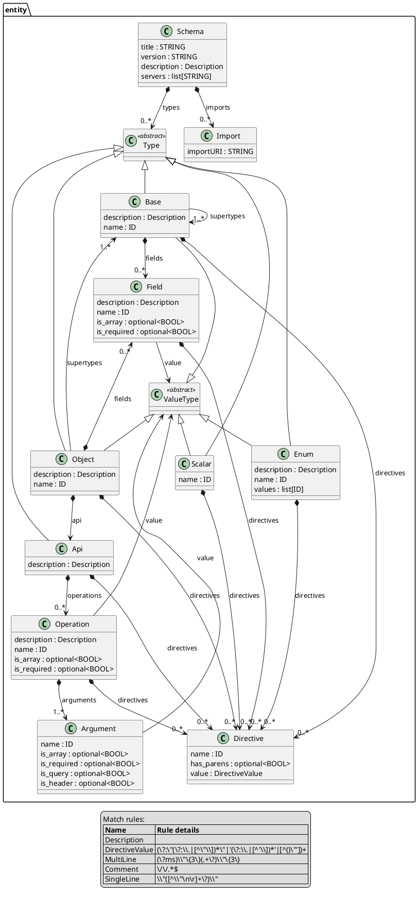

```plantuml
@startuml
set namespaceSeparator .


class entity.Schema  {
  title : STRING
  version : STRING
  description : Description
  servers : list[STRING]
}


class entity.Type <<abstract>> {
}


class entity.ValueType <<abstract>> {
}


class entity.Import  {
  importURI : STRING
}


class entity.Scalar  {
  name : ID
}


class entity.Enum  {
  description : Description
  name : ID
  values : list[ID]
}


class entity.Base  {
  description : Description
  name : ID
}


class entity.Object  {
  description : Description
  name : ID
}


class entity.Field  {
  description : Description
  name : ID
  is_array : optional<BOOL>
  is_required : optional<BOOL>
}


class entity.Api  {
  description : Description
}


class entity.Operation  {
  description : Description
  name : ID
  is_array : optional<BOOL>
  is_required : optional<BOOL>
}


class entity.Argument  {
  name : ID
  is_array : optional<BOOL>
  is_required : optional<BOOL>
  is_query : optional<BOOL>
  is_header : optional<BOOL>
}


class entity.Directive  {
  name : ID
  has_parens : optional<BOOL>
  value : DirectiveValue
}


entity.Schema *--> "0..*" entity.Import: imports
entity.Schema *--> "0..*" entity.Type: types
entity.Type <|-- entity.Scalar
entity.Type <|-- entity.Enum
entity.Type <|-- entity.Base
entity.Type <|-- entity.Api
entity.Type <|-- entity.Object
entity.ValueType <|-- entity.Scalar
entity.ValueType <|-- entity.Enum
entity.ValueType <|-- entity.Base
entity.ValueType <|-- entity.Object
entity.Scalar *--> "0..*" entity.Directive: directives
entity.Enum *--> "0..*" entity.Directive: directives
entity.Base --> "1..*" entity.Base: supertypes
entity.Base *--> "0..*" entity.Directive: directives
entity.Base *--> "0..*" entity.Field: fields
entity.Object --> "1..*" entity.Base: supertypes
entity.Object *--> "0..*" entity.Directive: directives
entity.Object *--> "0..*" entity.Field: fields
entity.Object *-->  entity.Api: api
entity.Field -->  entity.ValueType: value
entity.Field *--> "0..*" entity.Directive: directives
entity.Api *--> "0..*" entity.Directive: directives
entity.Api *--> "0..*" entity.Operation: operations
entity.Operation *--> "1..*" entity.Argument: arguments
entity.Operation -->  entity.ValueType: value
entity.Operation *--> "0..*" entity.Directive: directives
entity.Argument -->  entity.ValueType: value

legend
  Match rules:
  |= Name  |= Rule details |
  | Description |  |
  | DirectiveValue | (\?:\"(\?:\\\\.\|[^\"\\\\])*\"\|'(\?:\\\\.\|[^'\\\\])*'\|[^()\"'])+ |
  | MultiLine | (\?ms)\\\"\{3\}(.+\?)\\\"\{3\} |
  | Comment | \\/\\/.*$ |
  | SingleLine | \\\"([^\\\"\\n\\r]+\?)\\\" |
end legend

@enduml
```